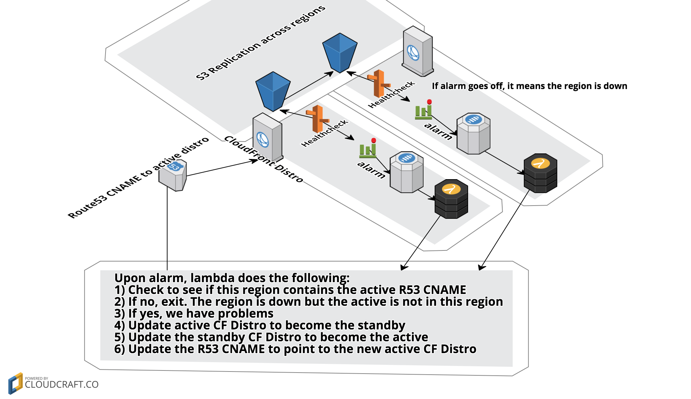

# s3-staticsite-multiregion
https://static-site.jolexa.us/
_______

## Motivation
On [February 28th](https://aws.amazon.com/message/41926/), AWS S3
in us-east-1 was
[down](https://techcrunch.com/2017/02/28/amazon-aws-s3-outage-is-breaking-things-for-a-lot-of-websites-and-apps/)
for several
[hours](https://techcrunch.com/2017/03/02/aws-cloudsplains-what-happend-to-s3-storage-on-monday/).
Many people, myself included, host static sites (or files) on S3. Static sites
backed by AWS S3 are great because they actually don't require servers to host a
website (#serverless, :D). However, this outage event broke many SLAs for
customers and was a general annoyance or even embarrassing. It is true that
other regions were not affected too much but `us-east-1` is the most popular
region and probably the biggest.

I don't want my personal sites to go down in this event. Companies don't want
their assets to be unavailable, or down. Many people can benefit from a better
solution here. In expected AWS fashion, they provide the tools (as seen here)
but not the end-to-end solution.

My goal is to provide a reference implementation of a multi-region s3 backed
static site (or CDN). Your mileage may vary but it is a simple enough concept
for me and does not require maintenance (or much extra cost) so I will be
switching my own assets to this model until something better is available.

## What?
If the S3 bucket it to serve files directly, the S3 bucket name must be the
domain name itself (eg, `static-site.jolexa.us`). Since S3 has a global
namespace, this means that you cannot have S3 bucket replication across regions
with the same bucket name, it is simply not possible by design. So, if we take
this to its conclusion, let's say we have `static-site.jolexa.us` bucket in
`us-east-1` which replicates to `static-site-standby.jolexa.us` bucket in
`us-west-2`, and east goes down, we cannot point our domain record to the
standby site, it will not work correctly.  Note we could _probably_ do something
clever here with nginx or similar, but that would require a server and we don't
want to rely on that, on principal.

Route53 Health Checks and failover DNS? This won't work either, for similar
reasons to the above.  The S3 bucket must be named the domain name.

Rumors are that, on the Feb 28 event, we couldn't even create/rename/update S3
in `us-west-2` since the S3 metadata service in `us-east-1` was not available (I
didn't confirm this).

A common pattern is to have CloudFront fronting an S3 bucket. This works but has
another set of limitations. Mainly that you cannot have multiple CF distros
which serve the same domain.

So, what does this mean? It means, that there is no native way to have a
multi-region static site hosted on S3.

The solution presented here, builds an S3 replication set with two CloudFront
distros and then will automagically switch everything around when a region is
down. Services leveraged: S3, CloudFront, CloudWatch, SNS, Lambda, & Route53
Health Checks which makes it entirely serverless, this is a big appeal of the
ease of an S3 hosted site in the first place! The architecture looks like this:

## How?
If you want to deploy this for yourself. Clone the repo, modify the top 6 lines
of the
[Makefile](https://github.com/jolexa/s3-staticsite-multiregion/blob/master/Makefile#L2-L8)
and run `make` - this will deploy multiple cloudformation stacks.  Described
below:

1. Stack to provision one ACM cert (must be us-east-1)
2. Standby Region infrastructure stack (any region)
  - S3 Replication target
  - CloudFront Distro
  - Route53 Health Check
  - Route53 ALIAS target (in a nested stack)
3. Standby Alarm stack (must be in us-east-1)
  - CloudWatch Alarm
  - SNS Topic
  - Lambda Function
4. Primary Region infrastructure stack (any region)
  - S3 Bucket that replicates to Standby Bucket
  - CloudFront Distro
  - Route53 Health Check
  - Route53 ALIAS target (in a nested stack)
5. Primary Alarm stack (must be in us-east-1)
  - CloudWatch Alarm
  - SNS Topic
  - Lambda Function

The Lambda Function is designed to be run by either CloudWatch alarm and does
the proper action based on Environment Variables that are passed at deploy time.

I choose to manage everything inside of CloudFormation because it represents the
most manageable infrastructure available as well as the least possible way of
interfering with existing infrastructure.

## Things I learned

* SAM CloudFormation artifacts must be in the same region as the Lambda Function
  but Nested Stack template artifacts can be in any region. This surprised me
  but it is why there is a call out to `us-east-1` bucket for artifacts.
* The amount of work (and documentation discovery!) to get some services
  communicating across regions is a high barrier to entry.
* CloudFront is global service but mostly managed in `us-east-1` (not
  confirmed). For this reason, both the ACM cert *and* CloudWatch Alarm for
  Route53 must be in `us-east-1`
* ACM integration with CloudFront is a great thing, extremely easy to use and
  secure a site. I was [experimenting](https://github.com/jolexa/aws-apigw-acm)
  with custom domains in API Gateway as well and since it uses CloudFront as a
  dependency, the ACM cert must be in `us-east-1` despite the API being in any
  region.
* I was surprised by AWS' own dependency on `us-east-1` and even though many
  services are multi-region, not all are and some mostly require us-east-1
  themselves (not confirmed, but seems likely when you use a mix of services
  more).  Maybe this is only the case with *older/mature* services?
* Using Lambda to update CloudFormation is possible but requires some trial and
  error to figure out what permissions are needed to update the stack.
* CloudFormation just calls APIs, such a great model. I knew this but it started
  to become very apparent with multiple stacks for a service.
* Nested stacks are elegant because you can update them out of band then have
  the parent stack update them back to a known state.

## Things I want to learn more about

* I want to know if it is faster to change a CloudFront CNAME *or* to switch the
  origin of a CloudFront Distribution. This is a pretty hard test though and it
  requires almost the same infrastructure.

## Cost

In practice, this architecture for a static site hosted on S3 will only incur a
few extra costs. Double the S3 costs for replicated storage. The Lambda, SNS, &
Health Checks will cost fractions of pennies. CloudWatch alarms will cost
$.20/month. Most of these costs will be within the perpetual free tier as well
so the actual cost will vary depending on your account size.

## Questions / Contact
I will be more than happy to answer any questions on GitHub Issues and review
Pull Requests to make this reference even better. Feel free to reach on on
Twitter as well.

## Credits / Thanks
* [Dan Farrell](https://github.com/farrellit) for peer reviewing this idea with
  me.
* https://static-site.jolexa.us/ is powered by
  [Strapdown.js](http://strapdownjs.com/) which I highly recommend for quick
  conversion of Markdown->HTML
